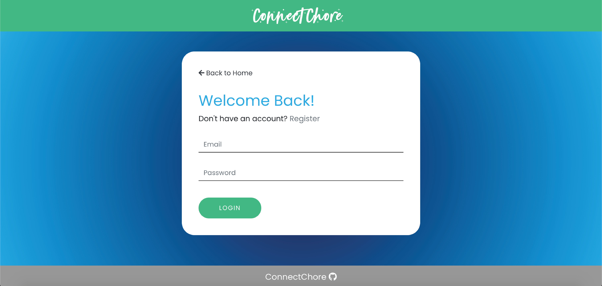
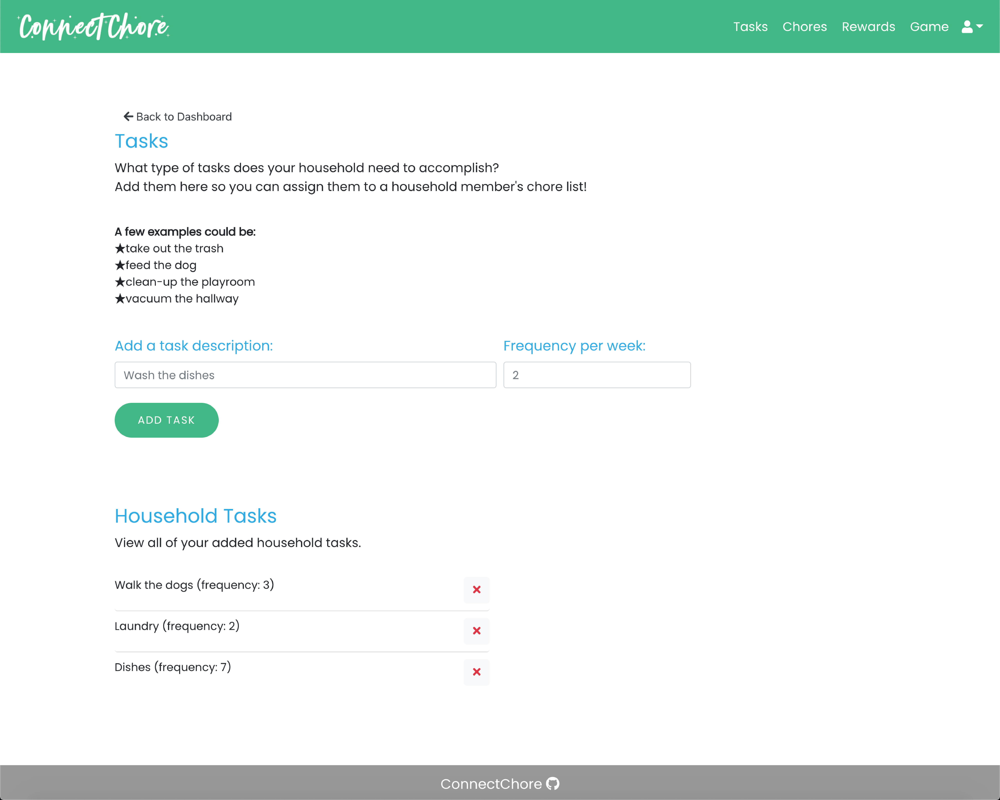

# ConnectChore Application
## Table of Contents
* [Description](#description)
* [Technologies](#technologies)
* [User Stories](#user-stories)
* [Future Enhancements](#future-enhancements)
* [Contributors](#contributors)
* [Questions and Collaboration](#questions-and-collaboration)
* [References](#references)
* [License](#license)
* [Screenshots](#screenshots)

## Description
Many people in this world have to coexist with one another. There are many chores around the house that have to get done so everybody is happy. You may have to mow the lawn, clean the toilet, make dinner or do laundry. After doing all these chores, you may want to be rewarded, right? 

Users can securely login into the application using an email address and password.

Once in the app, users can:
- Add family members and weekly tasks
- Create chorelists for each member and assign specific tasks and rewards for accomplishing them
- Family members/roommates also can play a game of ConnectChore to win the ultimate prize

Check out ConnectChore today! https://connectchore.herokuapp.com

## Technologies

|        Front-End |      Back-End |          Dev-Tools | Authentication |
|:-----------------|:--------------|:-------------------|:---------------|
|      Animate.css |         Axios |           Balsamiq |       Bcryptis |
|        Bootstrap |          Cors |              Canva |    Body-Parser |
|         Date-fns |       Express |       Concurrently |       is-empty |
| Font-Awesome     | Heroku        | Dotenv             | Jsonwebtoken   |
| Google Fonts     | MongoDB Atlas | Google G Suite     | Passport       |
| Immer            | Mongoose      | Nodemon            | Passport-jwt   |
| jQuery           | Morgan        | Postman            | Validator      |
| React            |               | redux-devtools-extension|           |
| React-bootstrap  |               | Trello             |                |
| React-confetti   |               | VSCode             |                |
| React-datepicker |               |                    |                |
| React-router-dom |               |                    |                |
| React-scroll     |               |                    |                |
| Redux            |               |                    |                |
| React-redux      |               |                    |                |
| Redux-thunk      |               |                    |                |

## User Stories

AS A parent 
I WANT a list of chores for my child. This will teach them to be responsible and earn rewards for every chore that is complete.

AS A child
I WANT a set list of tasks/chores. I want to be rewarded for the chores/tasks that I complete.

AS A Roommate
I WANT a list of household tasks to share. I want myself and the people under the same roof to have a peaceful coexistence.

AS A Spouse
I WANT clear delineation of responsibilities. In other words, I want to be able to know who does what so that there is no conflict.

## Future Enhancements
- Multiple logged in users per household
- Display history of tasks and rewards
- Reminders for chore list items
- Monetize/points-based individual chores towards an expensive reward

## Contributors

- [Ahmed Sheikh](https://github.com/ASheikh-io)
- [Andres Ramirez](https://github.com/ARam2142)
- [Bremah Lwanga](https://github.com/Bremah-mvp)
- [Hilary Ferraro](https://github.com/hilbug)
- [Kayla Dunphe](https://github.com/kdunphe)
- [Molly Kizer](https://github.com/LivesInRoom29)

## Questions and Collaboration
If you have questions, suggestions, or experience any bugs in the application, please submit an issue in the GitHub repository. 

If you would like to contribute to this project, please fork the repository and then create a pull request for your changes.

## References
- Many thanks to our TA team Bobby Hoffman and Mike Fearnley for their assistance.
- User Authentication Source
   - [Build a Login/Auth App with the MERN Stack — Part 1 (Backend)](https://blog.bitsrc.io/build-a-login-auth-app-with-mern-stack-part-1-c405048e3669)
   - [Build a Login/Auth App with the MERN Stack — Part 2 (Frontend & Redux Setup)](https://blog.bitsrc.io/build-a-login-auth-app-with-mern-stack-part-2-frontend-6eac4e38ee82)
   - [Build a Login/Auth App with the MERN Stack — Part 3 (Linking Redux with React Components)](https://blog.bitsrc.io/build-a-login-auth-app-with-the-mern-stack-part-3-react-components-88190f8db718)
- Game Logic
   - [Game Winner Logic](https://github.com/miki995/connect-four/blob/master/src/help%5Bers/winner/Winner.helper.js)
   - [Board Set-Up](https://www.youtube.com/watch?v=b0O3i4AyoE0&ab_channel=LukeSegars)

## License

This repository is licensed under the MIT License.

## ScreenShots

